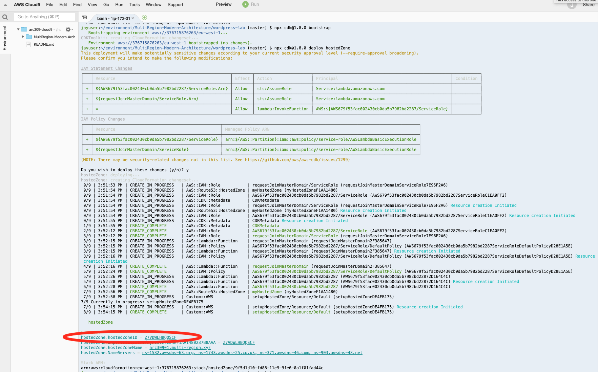
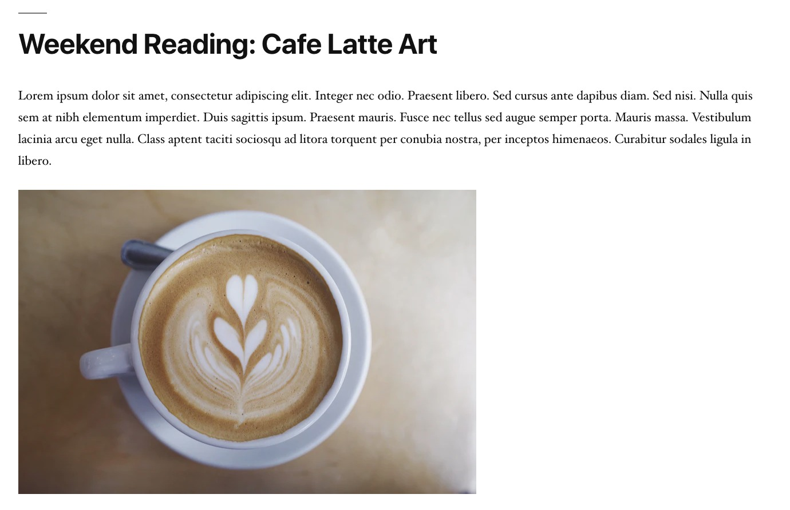
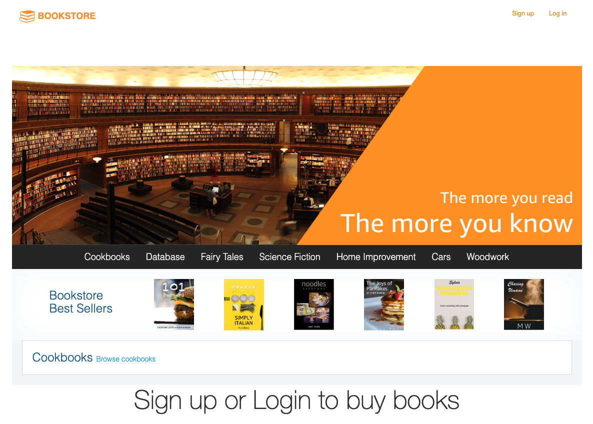

# Building the Bookstore in your Primary Region

In this module, you will deploy Bookstore application and Blog wordpress in primary (Irelad, eu-west-1) region using AWS CDK(Cloud Developemnt Kit) and AWS CloudFormation. This components include followings:
1. Fargate and Aurora - Book blog posts with wordpress (AWS Fargate is a compute engine for Amazon ECS and EKS that allows you to run containers without having to manage servers or clusters)
2. CloudFront and S3 - Web static content, ReactJS files
3. API Gateway, AWS Lambda and Cognito - App layer with authentication
4. DynamoDB and ElastiCache - Books, Order, Cart tables and Best Seller information

You will also create the IAM polices and roles required by these components.

## 1. Building your Book Blog using AWS CDK in your Primary Region (Ireland)

In Cloud9, go to `wordpress-lab` directory 
(ex. /home/ec2-user/environment/MultiRegion-Modern-Architecture/wordpress-lab)

```
cd ~/environment/MultiRegion-Modern-Architecture/wordpress-lab/
```


Deploy Wordpress for the Book blog using AWS CDK with ALB (Application Load Balancer), AWS Fargate, ACM, and Aurora MySQL in Primary Region (Ireland). Execute following commands one by one in AWS Cloud9.

```bash

export AWS_DEFAULT_REGION=eu-west-1
export MYSUBDOMAIN=<enter a 8 char unique subdomain name, eg: team1234>
npm install
npx cdk@1.8.0 bootstrap
npx cdk@1.8.0 deploy hostedZone
```

Now, let's check if the DNS is setup correctly in Route53. Open a new Terminal or iTerm and enter the following command to make sure you see that the DNS is resolving to the correct addresses.
```
dig +short NS <<YOUR HOSTED NAME URL>> e.g. myUniqueTeamName.multi-region.xyz
```


Now, compare the results with the ones in Route53. If they are the same, you can proceed to deploy the Wordpress. If not, please wait another 1 min before you seek help from the AWS instructors.

```
npx cdk@1.8.0 deploy Wordpress-Primary

```

```
Do you wish to deploy these changes (y/n)? 
```
Both `npx cdk@1.8.0 deploy hostedZone` and `Wordpress-Primary` commands ask this question. Type "Y", and it 
will take around 20 min.



* You need `hostedZone.hostedZoneID` (Z7VDWLHBQQSCF) information in the module 2.



**Your Book Blog is completed**

Now, your Book Blog is built. Please verify with following:
```
https://primary.blog.<MYSUBDOMAIN>.multi-region.xyz/

```


You need the VPC ID and Subnet ID for the next steps. You can check it in Cloud9 console or Cloudformation output tab in the Primary region (Ireland).


If you can find the VPC ID and Subnet ID from the VPC console in Ireland though the CDK is not completed, you can proceed the next step, CloudFormation stack creation.

## 2. Building the Bookstore using Cloudformation in your Primary Region (Ireland)

**Frontend**

Build artifacts are stored in a S3 bucket where web application assets are maintained (like book cover photos, web graphics, etc.). Amazon CloudFront caches the frontend content from S3, presenting the application to the user via a CloudFront distribution. The frontend interacts with Amazon Cognito and Amazon API Gateway only. Amazon Cognito is used for all authentication requests, whereas API Gateway (and Lambda) is used for all API calls interacting across DynamoDB and ElastiCache. 

**Backend**

The core of the backend infrastructure consists of Amazon Cognito, Amazon DynamoDB, AWS Lambda, and Amazon API Gateway. The application leverages Amazon Cognito for user authentication, and Amazon DynamoDB to store all of the data for books, orders, and the checkout cart. As books and orders are added, Amazon DynamoDB Streams trigger AWS Lambda functions that update the Amazon ElasticCache for Redis cluster that powers the books leaderboard (best seller). 

<!-- ### AWS Lambda

AWS Lambda is used in a few different places to run the application, as shown in the architecture diagram.  The important Lambda functions that are deployed as part of the template are shown below, and available in the [functions](/functions) folder.  In the cases where the response fields are blank, the application will return a statusCode 200 or 500 for success or failure, respectively. -->

<!-- ### Amazon ElastiCache for Redis

Amazon ElastiCache for Redis is used to provide the best sellers/leaderboard functionality.  In other words, the books that are the most ordered will be shown dynamically at the top of the best sellers list. 

For the purposes of creating the leaderboard, the AWS Bookstore Demo App utilized [ZINCRBY](https://redis.io/commands/zincrby), which *“Increments the score of member in the sorted set stored at key byincrement. If member does not exist in the sorted set, it is added with increment as its score (as if its previous score was 0.0). If key does not exist, a new sorted set with the specified member as its sole member is created.”*

The information to populate the leaderboard is provided from DynamoDB via DynamoDB Streams.  Whenever an order is placed (and subsequently created in the **Orders** table), this is streamed to Lambda, which updates the cache in ElastiCache for Redis.  The Lambda function used to pass this information is **UpdateBestSellers**.  -->

<!-- ### Amazon CloudFront and Amazon S3

Amazon CloudFront hosts the web application frontend that users interface with.  This includes web assets like pages and images.  For demo purposes, CloudFormation pulls these resources from S3. -->

**Developer Tools**

The frontend code (ReactJS) is hosted in AWS CodeCommit. AWS CodePipeline builds the web application using AWS CodeBuild. After successfully building, CodeBuild copies the build artifacts into a S3 bucket where the web application assets are maintained. Along with uploading to Amazon S3, CodeBuild invalidates the cache so users always see the latest experience when accessing the storefront through the Amazon CloudFront distribution.  AWS CodeCommit, AWS CodePipeline, and AWS CodeBuild are used in the deployment and update processes only, not while the application is in a steady-state of use.

<!--  -->

**Step-by-step instructions**

<!-- To build the Bookstore application using CloudFormation, you need to download the yaml file from [Primary CloudFormation](https://github.com/enghwa/MultiRegion-Modern-Architecture/blob/master/1_PrimaryRegion/arc309_primary.yaml).   -->

Before you create the Bookstore application in Ireland, 
go to the CloudFormation console in `Ireland` and find the VPC id and Subnet id in `Outputs` tab in `Wordpress-Primary` stack.


1. Create stack with the downloaded template
Create stack - Select 'Template is ready' and 'Upload a template file' and 'Choose file'. Or click the `Launch stack` button in the table.


Region name | Region code | Launch
--- | --- | ---
EU (Ireland) |	eu-west-1 | [](https://console.aws.amazon.com/cloudformation/home?region=eu-west-1#/stacks/new?stackName=MyBookstoreIreland&templateURL=https://arc309-bookstore-eu-west-1.s3-eu-west-1.amazonaws.com/arc309_primary.yaml) 

2. Input `Stack name` and `Parameters`
* **ProjectName**: 10 characters with lowercase (no number is allowed) (ex.bookstore)
* **AssetsBucketName**: S3 bucket name with lowercase (ex.arc309-ireland-bookstore)
* **SeedRepository**: Web file (use default)
* **bookstoreVPC**: VPC id (output of previous cdk, vpc-xxxxxxxxxx)
* **bookstoreSubnet1**: Subnet id for Elasticache (output of previous cdk, subnet-xxxxxxxxxx)

3. Skip the `Configure stack options` and check the box of `I acknowledge that AWS CloudFormation might create IAM resources with custom names.` in `Review` step. Select `Create stack`.


This CloudFormation template may take around 10 mins. You can hop over the progress of resources creation in `Events` tab in CloudFormation. 


Once your stack has successfully completed, navigate to the `Outputs` tab of your stack
where you find an `WebApplication` includes CloudFront Domain name. Type this URL in your broswer and check your Bookstore application.

```
https://d1zltjarei3438.cloudfront.net/
```


FYI. This Bookstore doesn't include the Book Blog yet that you created with CDK. It will be shown after you complete buiding the secondary region Bookstore application.

## Completion

Congratulations you have configured the bookstore in the primary region (Ireland). In the next module, you will replicate your data (Blog data in Aurora RDS, Web content in S3, Book data in DynamoDB) to the secondary region (Singapore) and build the same Blog and Bookstore application in the secondary region (Singapore) for Resilience and High availability. 

Module 2: [Build a Secondary region](../2_SecondaryRegion/README.md)
