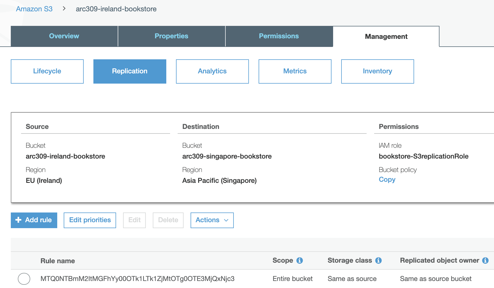
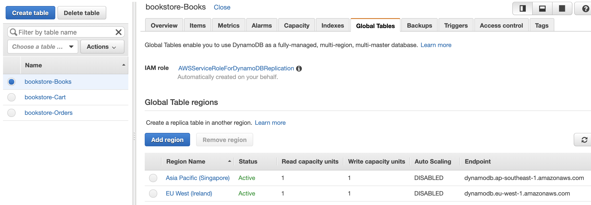

# Building the Bookstore in your Secondary Region (Singapore)

We completed building the bookstore in the primary region (Ireland) in the previous module. In this module, we will build the same Bookstore in Singapore region and configure the replication of Aurora MySQL for the Blog content, S3 bucket for static contects, and DynamoDB tables for the books/order/cart data from the primary region (Ireland) to the secondary region (Singapore).

## Building your Book Blog using AWS CDK in your Secondary Region (Singapore)

Go back to your Cloud9, and execute following commands.It will take around 15 mins. (It should be executed under `wordpress-lab` directory)
* **hostedZoneID**: Get this information from the output of CDK or CloudFormation in the module 1. (ex.Z7VDWLHBQQSCF)

* Your `MYSUBDOMAIN` was previously exported in module 1.

```bash
export hostedZoneID=<route53 hosted zone ID of MYSUBDOMAIN.multi-region.xyz>
export hostedZoneName=$MYSUBDOMAIN.multi-region.xyz
export AWS_DEFAULT_REGION=ap-southeast-1
npx cdk@1.8.0 bootstrap
npx cdk@1.8.0 deploy Wordpress-Secondary

```


Type "y" on `Do you wish to deploy these changes (y/n)?`.


Now, your Book Blog in Singapore is completed. However, you will find `503 Service Temporarily Unavailable` error if you verify `https://secondary.blog.<MYSUBDOMAIN>.multi-region.xyz/` as the wordpress is not connected the Aurora MySQL in Singapore region yet. We will configure this in the next section.

## Replication of Aurora, S3, and DynamoDB 

In this section, we will configure the replication of Aurora MySQL for the Blog content, S3 bucket for static contects, and DynamoDB tables for the books/order/cart data from the primary region (Ireland) to the secondary region (Singapore).

### 1. Enable Aurora MySQL Read replica in Singapore region

Aurora MySQL Read replica helps you have redundancy plan. The replica in Singapore region can be promoted as the primary database when the primary database in the primary region (Ireland) has issues.

Go back to Cloud9, and execute the following command to enable the read replica of Aurora MySQL in Singapore region
from Ireland region using the AWS CLI. 

* `replication-source-identifier`: Get from Cloudformation stack `Wordpress-Primary` in Ireland Region. Or use the following command in Cloud9.
```bash
aws cloudformation describe-stacks --stack-name Wordpress-Primary --region eu-west-1 \
    --query "Stacks[0].Outputs[?OutputKey=='RDSreplicationsourceidentifier'].OutputValue" --output text

```

* `vpc-security-group-ids`: Get from Cloudformation stack `Wordpress-Secondary` in Singapore Region. Or use the following command in Cloud9. 
```bash
aws cloudformation describe-stacks --stack-name Wordpress-Primary --region ap-southeast-1 \
    --query "Stacks[0].Outputs[?OutputKey=='WordpressDBsecurityGroupName'].OutputValue" --output text
```

CLI to create read replica of Aurora MySQL in Singapore region. 
```bash
aws rds create-db-cluster \
  --db-cluster-identifier <arc309-replica-cluster> \
  --engine aurora \
  --replication-source-identifier <arn:aws:rds:eu-west-1:xxxxxxxxxx:xxxxxxxxx> \
  --vpc-security-group-ids <sg-xxxxxxxxx> \
  --db-subnet-group-name <SecondaryRegion-WordpressDB-subnetgroup> \
  --source-region <eu-west-1> \
  --region <ap-southeast-1>
  
```

Verify the RDS replication cluster is created in Singapore region.
```bash
aws rds describe-db-clusters --db-cluster-identifier <arc309-replica-cluster> --region <ap-southeast-1>
```
Create RDS read replica instance. 

```bash
aws rds create-db-instance \
  --db-instance-identifier <arc309-replica-instance> \
  --db-cluster-identifier <arc309-replica-cluster> \
  --db-instance-class <db.t3.small> \
  --engine aurora \
  --region <ap-southeast-1>
```

Verify RDS replication in RDS console in Singapore region or using CLI in Cloud9.


It takes for a while, you can procced the next step first.

### 2. Enable S3 replication for Web contents replication

This S3 replication will replicate the static contents from Irelad region to Singapore whenever there is update. 
Follow the steps to enable the S3 replication using the AWS CLI in Cloud9.

```bash
aws s3api create-bucket \
  --bucket <arc309-singapore-bookstore> \
  --region <ap-southeast-1> \
  --create-bucket-configuration LocationConstraint=<ap-southeast-1>
```
```bash
aws s3api put-bucket-versioning \
  --bucket <arc309-singapore-bookstore> \
  --versioning-configuration Status=Enabled
```

<!-- aws s3 website s3://<AssetsBucketName-region2>/ --index-document index.html -->

<!-- $ aws iam create-role \
--role-name crrRole \
--assume-role-policy-document file://s3-role-trust-policy.json 

$ aws iam put-role-policy \
--role-name crrRole \
--policy-document file://s3-role-permissions-policy.json \
--policy-name crrRolePolicy \ -->

Add replication configuration to the source bucket in Ireland region. Save the following JSON in a file called replication.json to the your Cloud9. You need S3 replication role ARN for this exercise. You can find it in the output table of your CloudFormation stack (ex.arc309-ireland) in Ireland or execute following command in the Cloud9.

```bash
aws cloudformation describe-stacks --stack-name <arc309-ireland> --region eu-west-1 \
    --query "Stacks[0].Outputs[?OutputKey=='S3replicationRole'].OutputValue" --output text
```

To create `replication.json` file in the Cloud9, 
```bash
$vi replication.json
esc+i: insert
```
copy and paste the following and save with `esc+wq!`.

```
{
  "Role": "<IAM-role-ARN>",
  "Rules": [
    {
      "Status": "Enabled",
      "Priority": 1,
      "DeleteMarkerReplication": { "Status": "Disabled" },
      "Filter" : { "Prefix": ""},
      "Destination": {
        "Bucket": "arn:aws:s3:::<arc309-singapore-bookstore>"
      }
    }
  ]
}
```

```bash
aws s3api put-bucket-replication \
  --replication-configuration file://replication.json \
  --bucket <arc309-ireland-bookstore>
```

You can check the replication configuration in S3 console.


### 3. Enable DynamoDB Global Tables using Console

Let's take a look at continuously replicating the data in DynamoDB from the primary region (Ireland) to the
secondary region (Singapore) so that there is always a backup.

We will be using a feature of DynamoDB Global Tables for this. Any changes 
made to any items in any replica tables will be replicated to all of the other 
replicas within the same global table. In a global table, a newly-written item is 
usually propagated to all replica tables within seconds.

However, conflicts can arise if applications update the same item in different 
regions at about the same time. To ensure eventual consistency, DynamoDB global tables 
use a “last writer wins” reconciliation between concurrent updates, where DynamoDB makes 
a best effort to determine the last writer. 

Follow the steps to create a global table of Book, Order, Cart form the Ireland to Singapore regions using the console. 

Go to DynamoDB in Ireland. Select `Books` table, go to `Global Tables` tab, and click `Add region`


Select `Singapore`, and click `Continue`.


Do the same steps or `Orders` and `Cart` tables.

<!-- aws dynamodb create-table \
    --table-name <Books table name> \
    --attribute-definitions \
        AttributeName=id,AttributeType=S \
        AttributeName=category,AttributeType=S \
    --key-schema \
        AttributeName=id,KeyType=HASH \
    --provisioned-throughput \
        ReadCapacityUnits=1,WriteCapacityUnits=1 \
    --global-secondary-indexes IndexName=category-index,KeySchema=[{AttributeName=category,KeyType=HASH}],Projection={ProjectionType=ALL},ProvisionedThroughput={ReadCapacityUnits=1,WriteCapacityUnits=1} \
    --stream-specification StreamEnabled=true,StreamViewType=NEW_AND_OLD_IMAGES \
    --region <region2>

aws dynamodb create-table \
    --table-name <Order table name> \
    --attribute-definitions \
        AttributeName=customerId,AttributeType=S \
        AttributeName=orderId,AttributeType=S \
    --key-schema \
        AttributeName=customerId,KeyType=HASH \
        AttributeName=orderId,KeyType=RANGE \
    --provisioned-throughput \
        ReadCapacityUnits=1,WriteCapacityUnits=1 \
    --stream-specification StreamEnabled=true,StreamViewType=NEW_AND_OLD_IMAGES \
    --region <region2>

aws dynamodb create-table \
    --table-name <Cart table name> \
    --attribute-definitions \
        AttributeName=customerId,AttributeType=S \
        AttributeName=bookId,AttributeType=S \
    --key-schema \
        AttributeName=customerId,KeyType=HASH \
        AttributeName=bookId,KeyType=RANGE \
    --provisioned-throughput \
        ReadCapacityUnits=1,WriteCapacityUnits=1 \
    --stream-specification StreamEnabled=true,StreamViewType=NEW_AND_OLD_IMAGES \
    --region <region2>

aws dynamodb create-global-table \
    --global-table-name <Book table name>  \
    --replication-group RegionName=<region1> RegionName=<region2> \
    --region <region2> -->

Now, you completed the replication across two regions for Aurora MySQL, S3, and DynamoDB. It's time to build the Bookstore eb/App layer in Singapore. 

## Building the Bookstore using Cloudformation in your Secondary Region (Singapore)

**Step-by-step instructions**

To build the Bookstore application using CloudFormation, you need to download the yaml file from [Secondary CloudFormation](https://github.com/enghwa/MultiRegion-Modern-Architecture/blob/master/1_SecondaryRegion/arc309_secondary.yaml).  
**TOFIX:Change the file download location to S3 arc309 bucket.**

1. Go to the CloudFormation console in Singapore
2. Create stack with the downloaded template
3. Input `Stack name` (ex. arc309-singapore) and `Parameters`
* **ProjectName**: the same 10 characters with lowercase name (ex.bookstore)
* **AssetsBucketName**: S3 bucket name replicated from Ireland (ex.arc309-singapore-bookstore)
* **bookstoreVPC**: VPC id (output of `Wordpress-Secondary` cdk, vpc-xxxxxxxxxx)
* **bookstoreSubnet1**: Subnet id for Elasticache (output of `Wordpress-Secondary` cdk, subnet-xxxxxxxxxx)
* **OrderTableStreamARN**: Stream ARN of `Order` table in Dynamo Table in Singapore (ex. arn:aws:dynamodb:ap-southeast-1:376715876263:table/bookstore-Orders/stream/2019-11-03T06:37:12.684)
* **UserPool**: Congnito UserPool Arn in Ireland region (ex. arn:aws:cognito-idp:eu-west-1:376715876263:userpool/eu-west-1_1rry319Ri)

5. Skip the `Configure stack options` and check the box of `I acknowledge that AWS CloudFormation might create IAM resources with custom names.` in `Review` step. Select `Create stack`.

This CloudFormation template may take around 10 mins. You can proceed the next steps.

## CDK
You remember the Book Blog you created above had `503 Service Temporarily Unavailable` error due to the Fargate didn't connect to Aurora MySQL in Singapore. 


aws rds describe-db-instances \ 
--db-instance-identifier <sample-instance> \
--region <region2> | grep Endpoint


## Cloudfront Origin Group

To enable Origin Failover for your CloudFront distributions to improve the availability of content delivered to your end users.

With CloudFront’s Origin Failover capability, you can setup two origins for your distributions - primary (Ireland) and secondary (Singapore), such that your content is served from your secondary origin if CloudFront detects that your primary origin is unavailable. For example, you can have two Amazon S3 buckets that serve as your origin, that you independently upload your content to. If an object that CloudFront requests from your primary bucket is not present or if connection to your primary bucket times-out, CloudFront will request the object from your secondary bucket. So, you can configure CloudFront to trigger a failover in response to either HTTP 4xx or 5xx status codes.

To get started, create the second origin with the same OAI (Origin Access Identity) of the primary origin. You can choose the S3 bucket in the second region (Singapore) that you created above for the Origin Domain Name.


Next, create an origin group in which you designate a primary origin for CloudFront plus a second origin that CloudFront automatically switches to when the primary origin returns specific HTTP status code failure responses.


If you need to remove a file from CloudFront edge caches before it expires, you can do Invalidate the file from edge caches:

    aws cloudfront create-invalidation --distribution-id <value> --paths /

## update Blog url to the webasset and it will kick off another codepipeline

Find your code repo in codecommit and edit: (screenshot) under src/ in Oregon
`wordpressconfig.ts`.
Update:
`https://blog.<your subdomain name>.multi-region.xyz`

eg:
assume my `MYSUBDOMAIN` i set previously was `team5432`,
```javascript
export default {

  wordpress: {
    WPURL: "https://blog.team5432.multi-region.xyz/"
  }
}
```
author and email. -> commit changes 
you can check the build process in codepipeline.
once codepipeline fully build again, blog should show up at cloudfront url.

next:
## update Cloudfront to your domain name instead of `https://?????????????.cloudfront.net`:

an ACM cert is already created for CloudFront in your region.

Update Cloudfront CNAME to `$MYSUBDOMAIN.multi-region.xyz` (screenshot)
in Cloudfront, general tab - Alternate Domain Names (CNAMEs) and SSL Certificate

in Route53, create an apex record:
Alias 'Yes', Type `A` and point it to the cloudfront domain name, `?????????????.cloudfront.net`. (screenshot)

## Completion

Congratulations! You have successfully deployed a user interface for our users
on S3. In the next module you will learn how to configure active/active using Route53.


## Replicated to the seconday region

So now that you have a separate stack.

You can test to see if it is working by ordering a new book. Then, look at the Order table in *source* region DynamoDB and the DynamoDB table in your *secondary* region, and see if you can see the record
for the book you just ordered. 

Module 3: [Configure Active-Active Route53](../3_Route53Configuration/README.md)


