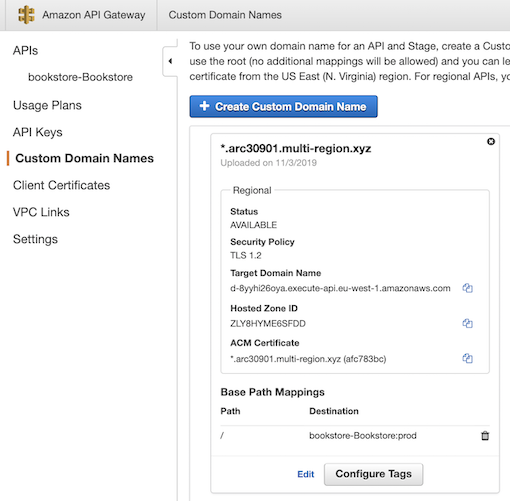

# Testing Multi-region Failover

To have real confidence in our multi-region active-active setup, we need to test it.
In this module we will artificially break our
primary region and observe our failover in action.

To demonstrate this we coduct a scenario where a developer
accidentally deletes production setting in API gateway in
primary region (Ireland), thus breaking the API layer. We expect our application detects
this failure and adjusts the DNS settings to continue service of the
application from the second region (Singapore)
maintaining availability of the API/Database and functionality of the UI.

## 1. Breaking API layer in primary region (Ireland)

In the AWS Console, ensure you are in your primary region (Ireland) then head over to
`API Gateway`, choose your `Custom Domain Name`. Then delete the `Base Path Mappings` and save changes.

## 2. Verifying the failure

Now head over to `Route53` and select `Health checks`. Within a few
minutes, your health check should turn from Green to `Red` and display a
failure.

Since your DNS records are configured to use this health check, Route53 should
automatically use this information to point your domain at your another
region.

You can validate this failover scenario when you visit `https://api-ir.arc30901.multi-region.xyz/books` with `Interanl Server Error`. However, you will get the book list when you visit `https://api.arc30901.multi-region.xyz/books` as the Singapore region API is working properly (same as `https://api-sg.arc30901.multi-region.xyz/books`. 

You're UI should also continue to 
function and you should still be able to view and order books.

To confirm everything went as expected, go to your Bookstore application (`https://arc30901.multi-region.xyz/books`)
and order a book again. You should see your application indicates Singapore region. 

And your DynamoDB tables in both Irelad and Singapore have the same items though you created
tickets in any places. 

## Completion

Congratulations! You have now setup and verified an API that fails over from
one region to another automatically in the event of a disaster.

If you are feeling adventurous, you can read to the optional lab - [Global Accelerlator](../6_Optional/README.md).

Else to end the lab and prevent further AWS charges, please clean-up the AWS resources created in this workshop by following the [steps here.](../5_Cleanup/README.md)

The application you have built includes many components that you would need to
build your own Serverless applications in AWS including [AWS
Cognito](https://aws.amazon.com/cognito) for authentication, [AWS
Lambda](https://aws.amazon.com/lambda) for compute, [Amazon API
Gateway](https://aws.amazon.com/apigateway) for exposing an HTTP interface and
[DynamoDB](https://aws.amazon.com/dynamodb) for storing application data. A
good next step would be to start modifying this application to add your own
features and explore these services further.
