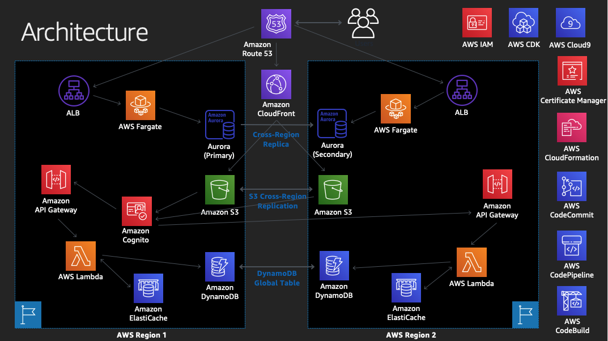

# MultiRegion-Modern-Architecture

The application will utilize three layers:

1. 
2. 
3. 

### Modules
0. Create AWS Cloud9 Environment
1. Build a Primary region Bookstore: CDK / CFN
2. Build multi-region solution: Aurora, S3, DynamoDB
3. Build a Seconary region Bookstore: CDK / CFN
4. Congifure Active-Active: Route53, ACM, DNS Health Check
5. Test failover
6. Cleaning Up

### 1. Primary region - CDK
VPC, Subnet, Security group, routetable (refer to cfn)
ALB, Fargate, Aurora (with custom parameter group, cluster, writer, read)
2nd region VPC, Subnet, Security group, routetable (refer to cfn) 

-> It takes 20mins. Execute this one then presentation? output aurora arn

### 1. Primary region - CFN
Remove metadata, neptune, search (dependson), apigateway (auth:none 3 item, book, bestselleors), s3 (version enable)
input param (vpc cdk#1)
route53 hostzone -> call remote api do nsrecord xyz (random number acm) -> origincal acm region1/2 (auto approval)

### 1. Update blog URL and Cloudfront 
content is in the cdk readme

### 2. Build multi-region solution - Aurora cross-region read replica(2nd region)
in Cloud9, --region

aws rds create-db-cluster \
  --db-cluster-identifier <sample-replica-cluster> \
  --engine aurora \
  --replication-source-identifier <source aurora arn> \
  --region <region2>

aws rds describe-db-clusters --db-cluster-identifier sample-replica-cluster

aws rds create-db-instance \
  --db-instance-identifier test-instance
  --db-cluster-identifier <sample-replica-cluster> \
  --db-instance-class <db.t3.small> \
  --engine aurora \
  --region <region2>

The endpoint should be updated in the fargate

### 2. Build multi-region solution - S3
aws s3api create-bucket \
--bucket <AssetsBucketName-region2> \
--region <us-west-2> \
--create-bucket-configuration LocationConstraint=<us-west-2>

aws s3api put-bucket-versioning \
--bucket <AssetsBucketName-region2> \
--versioning-configuration Status=Enabled

<!-- aws s3 website s3://<AssetsBucketName-region2>/ --index-document index.html -->

<!-- $ aws iam create-role \
--role-name crrRole \
--assume-role-policy-document file://s3-role-trust-policy.json 

$ aws iam put-role-policy \
--role-name crrRole \
--policy-document file://s3-role-permissions-policy.json \
--policy-name crrRolePolicy \ -->

{
  "Role": "<IAM-role-ARN>",
  "Rules": [
    {
      "Status": "Enabled",
      "Priority": 1,
      "DeleteMarkerReplication": { "Status": "Disabled" },
      "Filter" : { "Prefix": ""},
      "Destination": {
        "Bucket": "arn:aws:s3:::<bucketname-region2>"
      }
    }
  ]
}

$ aws s3api put-bucket-replication \
--replication-configuration file://replication.json \
--bucket <source>

https://docs.aws.amazon.com/AmazonS3/latest/dev/crr-walkthrough1.html

### 2. Build multi-region solution - DynamoDB (Q. it's complated cli than console. one with cli, two with ui)
aws dynamodb create-table \
    --table-name teres-Cart \
    --attribute-definitions \
        AttributeName=customerId,AttributeType=S \
        AttributeName=bookId,AttributeType=S \
    --key-schema \
        AttributeName=customerId,KeyType=HASH \
        AttributeName=bookId,KeyType=RANGE \
    --provisioned-throughput \
        ReadCapacityUnits=1,WriteCapacityUnits=1 \
    --stream-specification StreamEnabled=true,StreamViewType=NEW_AND_OLD_IMAGES \
    --region eu-central-1

aws dynamodb create-global-table \
    --global-table-name teres-Cart \
    --replication-group RegionName=us-west-2 RegionName=eu-central-1 \
    --region us-west-2

### 3. Secondary region - CDK
ACM, Route53 Domain Name and the DNS
ALB, fargate, input param (VPC cdk#1, aurora read endpoint of #2)
Q. we will creat the custom domain in api? -> if not how to health check and routing policy in route53?

### 3. Secondary region - CFN
cognito, apigateway, lambda, cache 
input param (vpc cdk#1, s3 #2, dynamodb #2)

### 5. Failover
1. Delete Fargate Service
2. API gateway: books get disable
3. Delete (aurora, dynamdb) - video 

Low priority: Cloudfront s3 origin group

how to automate route53 registation
we need to acm auto approval